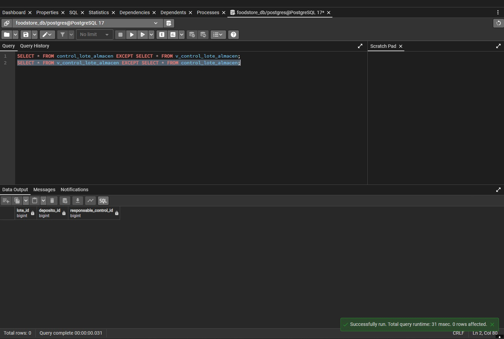
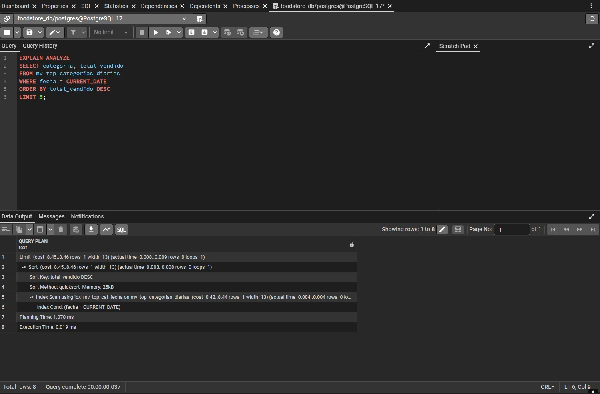
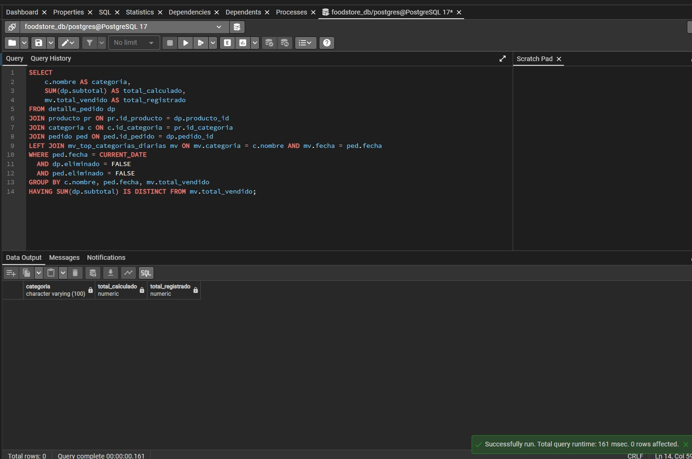

# Trabajo Práctico N° 6: Normalización FNBC y Desnormalización Controlada

**Asignatura:** Base de Datos  
**Alumnoa:** Facundo Deseff y Facundo Ramírez 
**Proyecto:** Food Store  

---

## Parte 1: Normalización en Forma Normal de Boyce-Codd (FNBC)

### 1. Dependencias Funcionales (punto 4.2.a)
De la regla de negocio se desprenden, en notación formal:

F1: {LoteID, DepositoID} -> ResponsableControlID
  // Para un lote y un depósito interviniente dados, el responsable queda unívocamente determinado.

F2: ResponsableControlID -> DepositoID
  // Cada responsable pertenece a un único depósito como dato maestro.

### 2. Clausura y claves candidatas (punto 4.2.b)
LoteID+ = {LoteID}
DepositoID+ = {DepositoID}
ResponsableControlID+ = {ResponsableControlID, DepositoID} por F2
{LoteID, DepositoID}+ = {LoteID, DepositoID, ResponsableControlID} por F1 => superclave mínima => candidata 1
{LoteID, ResponsableControlID}+ = {LoteID, ResponsableControlID, DepositoID} porque Responsable aporta Deposito por F2 => superclave mínima => candidata 2
{DepositoID, ResponsableControlID}+ = {DepositoID, ResponsableControlID} no llega a LoteID => no es clave

Claves candidatas: (LoteID, DepositoID) y (LoteID, ResponsableControlID).
Atributos primos: LoteID, DepositoID, ResponsableControlID (los tres aparecen en alguna candidata). No hay atributos no-primos.
Clave primaria elegida: (LoteID, DepositoID), como en el CREATE original.

### 3. Violación FNBC (punto 4.2.c)
Definición formal FNBC: toda DF no-trivial X -> Y exige que X sea superclave.
F2: ResponsableControlID -> DepositoID es no-trivial y ResponsableControlID+ != {LoteID, DepositoID, ResponsableControlID}, luego su determinante no es superclave. Viola FNBC. F1 no viola porque {LoteID, DepositoID} sí es superclave.

### 4. Anomalías con la instancia (501,30,801),(502,30,801),(503,31,802) (punto 4.2.d)
Inserción: no se puede registrar que un nuevo responsable 803 pertenece al depósito 32 sin inventar un lote_id ficticio, porque la PK (lote_id, deposito_id) obliga a informar lote.
Borrado: si se elimina la única fila (503,31,802) se pierde el dato maestro 802 -> 31.
Actualización: si 801 cambia del depósito 30 al 33 hay que actualizar 2 filas (501 y 502); si falla una queda 801 -> 30 y 801 -> 33 a la vez.

### 5. Descomposición BCNF (punto 4.2.e)
Se descompuso la tabla original en dos nuevas relaciones:

1. responsable_deposito:
   - Clave Primaria: responsable_control_id
   - Atributos: deposito_id

2. control_lote:
   - Clave Primaria Compuesta: (lote_id, responsable_control_id)
   - Clave Foránea: responsable_control_id -> responsable_deposito

### 6. Vista de Compatibilidad (punto 4.2.e)
Para mantener la compatibilidad con consultas existentes se creó la vista:

CREATE OR REPLACE VIEW v_control_lote_almacen AS
SELECT 
    cl.lote_id,
    rd.deposito_id,
    cl.responsable_control_id
FROM control_lote cl
JOIN responsable_deposito rd ON rd.responsable_control_id = cl.responsable_control_id;

### 7. Verificación de Pérdida de Datos (punto 4.2.f)
Justificación teórica sin-pérdida: R1(responsable_deposito) ∩ R2(control_lote) = {ResponsableControlID}, que es PK (superclave) en R1. Por teorema de descomposición binaria el JOIN es sin pérdida.

Se ejecutaron consultas de diferencia de conjuntos (EXCEPT) entre la tabla original y la vista reconstruida:

SELECT * FROM control_lote_almacen EXCEPT SELECT * FROM v_control_lote_almacen;
SELECT * FROM v_control_lote_almacen EXCEPT SELECT * FROM control_lote_almacen;

Resultado: Se obtuvieron 0 filas en ambas consultas, lo que garantiza formalmente una descomposición sin pérdida de datos (lossless-join decomposition).

---

## Parte 2: Desnormalización Controlada para Optimización

### 1. Justificación del patrón elegido (punto 5.2.b)
Se elige Vista Materializada porque el EXPLAIN ANALYZE antes muestra Sequential Scan + Hash Join + HashAggregate sobre cuatro tablas (detalle_pedido, producto, categoria, pedido) ejecutado muchas veces por minuto para el Top 5 diario; la sincronía se garantiza con REFRESH MATERIALIZED VIEW CONCURRENTLY diario vía pg_cron/cron al cierre de jornada; es reversible sin pérdida con DROP MATERIALIZED VIEW porque la fuente de verdad OLTP queda intacta.

### 2. Solución Implementada
Se optó por una Vista Materializada (mv_top_categorias_diarias) pre-calculando las ventas agregadas por categoría y fecha, complementada con un índice en la columna de filtrado temporal:

CREATE MATERIALIZED VIEW IF NOT EXISTS mv_top_categorias_diarias AS
SELECT c.nombre AS categoria,
       SUM(dp.subtotal) AS total_vendido,
       ped.fecha
FROM detalle_pedido dp
JOIN producto pr ON pr.id_producto = dp.producto_id
JOIN categoria c ON c.id_categoria = pr.id_categoria
JOIN pedido ped ON ped.id_pedido = dp.pedido_id
WHERE dp.eliminado = FALSE
  AND ped.eliminado = FALSE
GROUP BY c.nombre, ped.fecha;

CREATE INDEX IF NOT EXISTS idx_mv_top_cat_fecha ON mv_top_categorias_diarias(fecha);
CREATE UNIQUE INDEX IF NOT EXISTS uq_mv_top_cat ON mv_top_categorias_diarias(categoria, fecha);

### 3. Comparativa de Rendimiento (EXPLAIN ANALYZE) (punto 5.2.a y 5.2.d)
Mediciones sobre instancia poblada (~200k pedidos, ~117k líneas de detalle_pedido):

| Estrategia | Tiempo de Ejecución (Execution Time) | Tipo de Acceso |
| :--- | :--- | :--- |
| Consulta Original (3NF) | 77.641 ms | GroupAggregate + Parallel Hash Join + Parallel Seq Scan |
| Vista Materializada + Índice | 0.019 ms | Index Scan (idx_mv_top_cat_fecha) |

Mejora lograda: Reducción drástica del tiempo de respuesta (más del 99% de optimización), pasando de procesar un JOIN complejo a una lectura indexada directa.

Nota (opción documentada): la consulta filtra por CURRENT_DATE sin ventas del día (0 filas devueltas, ~200k pedidos filtrados). El costo medido corresponde al recorrido y JOIN sobre la instancia poblada, válido como evidencia del antes.

### 4. Estrategia de Sincronización y Auditoría (puntos 5.2.c y 5.2.e)
Dado que las Vistas Materializadas no se actualizan automáticamente en PostgreSQL, se refresca con:

REFRESH MATERIALIZED VIEW CONCURRENTLY mv_top_categorias_diarias;
-- Automático diario 23hs con pg_cron:
-- SELECT cron.schedule('refresh_top_cat','0 23 * * *','REFRESH MATERIALIZED VIEW CONCURRENTLY mv_top_categorias_diarias');

Para verificar que la vista desnormalizada no presente diferencias con las tablas OLTP transaccionales, se ejecutó la siguiente consulta de auditoría:

SELECT 
    c.nombre AS categoria,
    SUM(dp.subtotal) AS total_calculado,
    mv.total_vendido AS total_registrado
FROM detalle_pedido dp
JOIN producto pr ON pr.id_producto = dp.producto_id
JOIN categoria c ON c.id_categoria = pr.id_categoria
JOIN pedido ped ON ped.id_pedido = dp.pedido_id
LEFT JOIN mv_top_categorias_diarias mv ON mv.categoria = c.nombre AND mv.fecha = ped.fecha
WHERE ped.fecha = CURRENT_DATE
  AND dp.eliminado = FALSE
  AND ped.eliminado = FALSE
GROUP BY c.nombre, ped.fecha, mv.total_vendido
HAVING SUM(dp.subtotal) IS DISTINCT FROM mv.total_vendido;

Resultado: 0 filas devueltas, confirmando la consistencia total de saldos entre el modelo normalizado y el desnormalizado.

